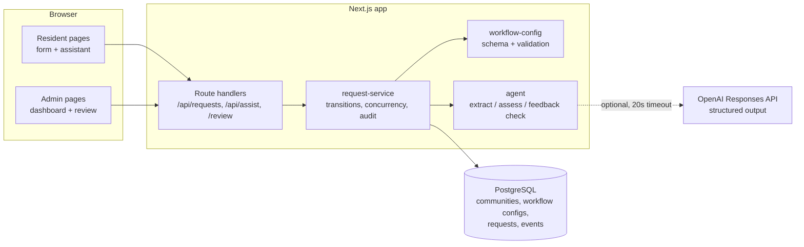
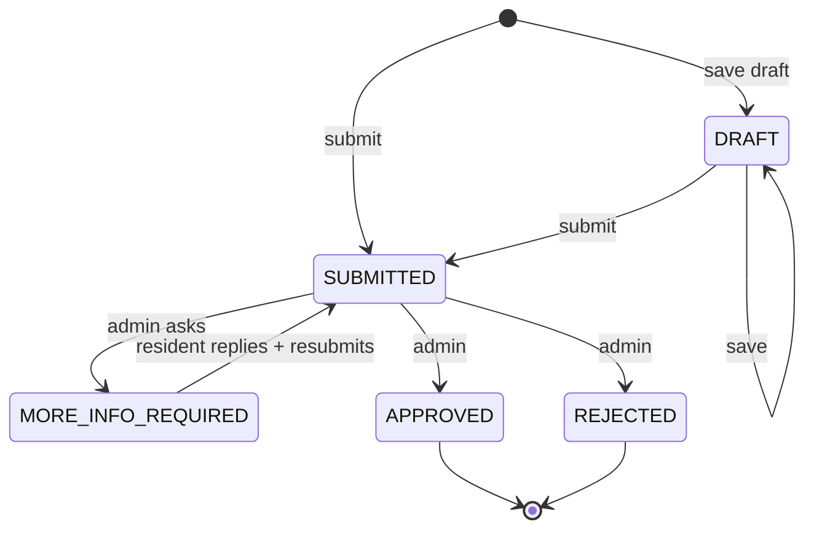

# Move-in / Move-out: design notes

## 1. How I read the problem

Moving in or out of a gated community is rarely a single form. In a typical Indian residential society, a move-in involves telling management who will live in the unit, registering vehicles for parking stickers, arranging a gate pass for the moving truck and sometimes booking the service lift. A move-out usually means clearing maintenance dues, returning keys and access cards, booking the lift again and getting an exit gate pass. Every society does this a little differently, and the admin reviewing requests is often juggling dozens of them with move dates close together.

That gave me three needs to design for:

- **Residents** need to know exactly what their community wants, submit it once, understand what the admin is asking if something is missing, and know what to do after approval.
- **Admins** need to see what is waiting on them, which move dates are closest, whether a request is complete, and, when a request comes back after they asked a question, whether their question was actually answered.
- **The business** needs one system that serves many communities with different rules, without a code change for each one.

I scoped the prototype to the request → review → decision loop, because that is where both roles meet and where the agent can help most. I left out document uploads, payments, dues lookups and lift/slot booking. Each of those needs an integration with a real ANACITY system (billing, gate management) that I could not credibly fake, and pretending to verify a document with an LLM would be worse than not doing it. Section 9 describes how I would add them.

## 2. Resident journey

1. **Start**: choose Move in or Move out, then the community. The form is generated from that community's configuration, with its description and help text.
2. **Fill in, manually or with the assistant**: the resident can describe the move in plain words ("I'm a tenant moving into B-1204 on 15 April with two people and one car"). The assistant proposes field values, each with the phrase it came from, and lists anything missing or unclear. Proposals fill the form only when the resident clicks Apply; nothing is saved automatically.
3. **Save a draft or submit**: the same validation runs in the browser and on the server. A submitted request gets a readable reference (for example `REQ-MI-1004`).
4. **Track**: the dashboard shows each request's status and move date, and flags **Action needed** when the admin has asked for more information.
5. **Respond**: when the admin asks a question, the request reopens. The resident corrects any fields and writes a **Reply to admin**. The reply is required and is stored as a message in the history, not stuffed into a form field.
6. **After a decision**: an approved request shows the community's configured next steps (for example, collect a gate pass, register vehicles). A rejected one shows the admin's reason.

## 3. Admin journey

1. **Triage**: the dashboard opens on **Needs action**, sorted by nearest move date, with an urgency hint ("In 2 days", "Date has passed"). Tabs for More info requested, Decided and All show counts.
2. **Understand**: the request page shows the answers, application checks re-run at view time (so a move date that has since passed is caught), the AI summary and recommendation, and the full history.
3. **Resubmissions**: when a request comes back, a **Resubmission** panel shows the admin's original question, the resident's reply, a field-by-field list of what changed (computed in code, not by the model), and the AI's verdict: *Addressed*, *Partially addressed* or *Not addressed*, with a short note.
4. **Decide**: approve, request more information, or reject. Rejection and information requests need a written message, and rejection asks for confirmation because it is final. Approval is blocked while application checks fail. The AI never makes the decision.

## 4. Architecture

It is a single Next.js application: server-rendered pages read from PostgreSQL through Prisma, and client components call JSON route handlers for mutations. There are no background workers.

**Request lifecycle**

Transitions live in one function (`canTransition`). Every status change and its audit event are written in one transaction. Updates include the expected status and `updatedAt`, so a stale tab or two admins acting at once get a conflict rather than silently overwriting each other. AI calls run before the transaction, never inside it.

**State I store**

| Data | Why |
|---|---|
| `CommunityWorkflow.config` (JSON, validated) | The community's fields, rules and next steps for each request type. |
| `MoveRequest.workflowSnapshot` | The exact rules the request was submitted under, so editing a community's config later doesn't change existing requests. |
| `MoveRequest.data` | Current answers. |
| `MoveRequest.aiAssessment` | The latest assessment, including the feedback verdict. |
| `RequestEvent` | Append-only history: who did what, the answers at each submission, admin messages, resident replies and the computed changes. |

## 5. The agent

### Where AI adds value, and where it doesn't

I used AI for the three jobs that are about interpreting language, and kept everything that has a right answer in plain code.

| Job | When | Input context | Output |
|---|---|---|---|
| **Intake extraction** | Resident clicks "Suggest field values" | Community config (or the request's snapshot), current answers, the resident's description, today's date and, when correcting a request, the admin's question | Proposed values with quoted evidence, missing items, clarifying questions |
| **Submission summary** | Every submit / resubmit | Config snapshot, submitted answers | Short summary for the admin, a non-binding recommendation and reasons |
| **Feedback check** | Resubmission after a more-info request | The admin's question, the resident's reply, the previous answers, and the list of changed fields | Addressed / Partially addressed / Not addressed, plus a note on what is still outstanding |

The feedback check is the part I think matters most. Without it the summary mostly repeated answers the admin could already see. With it, the model answers the question an admin actually has on a resubmission: *did they fix what I asked for?* The field diff is computed in code and handed to the model, so the model reasons about the change rather than trying to find it.

Everything deterministic stays in code: required fields, number ranges, select options, date rules, the list of changed fields, allowed transitions and the approve/reject action itself.

### Guide, recommend, decide, act

| Level | What the agent does here | What it never does |
|---|---|---|
| **Guide** | Proposes field values from the resident's own words, lists missing items and asks for clarification when something is ambiguous | Fill the form without the resident clicking Apply |
| **Recommend** | Gives the admin a summary, READY_FOR_REVIEW or NEEDS_INFORMATION with reasons, and the feedback verdict | Hide the underlying answers; the admin always sees the raw data next to the AI output |
| **Decide** | Nothing | Approve, reject or request information. Only an admin action triggers those mutations |
| **Act** | Nothing | Write to the database, contact anyone or change a request |

I kept autonomy low on purpose. A wrong approval lets someone into a building, and the cost of a human clicking Approve is a few seconds. If I were to raise autonomy, the first step would be a per-community setting to auto-approve requests where every deterministic check passes and the AI finds nothing, still with a full audit trail.

### Guardrails

- **Structured output only**: the model must return JSON matching a strict schema. Anything else, including an extra key such as `approve`, is treated as a failed call.
- **Each proposal is checked independently**: a proposal is dropped if its key isn't in the config, it repeats a key, or its evidence phrase can't be found in the resident's text (the match ignores case, spacing and punctuation). One bad proposal doesn't discard the good ones.
- **Invalid values become questions**: if the resident wrote a date in the past, the proposal isn't applied and the resident sees a clarification ("'2025-03-15' was not applied. Planned move date must be after today…") rather than a generic error.
- **Deterministic overrides**: if code finds missing fields or the model reports ambiguities, or the feedback verdict is *not* or *partially addressed*, the recommendation is forced to NEEDS_INFORMATION regardless of what the model said.
- **Resident text is treated as data**, and the prompt says so. I don't rely on that alone, which is why the output checks above exist.

### Ambiguity

The extraction prompt tells the model not to guess unclear dates or values, and to return a clarifying question instead. Those questions, the missing items and any rejected values appear together under "Please clarify or complete". The resident edits the description or the form and asks again.

### When the model is unavailable

No API key, a timeout (20 s, no retries), a refusal or malformed output all produce the same labelled fallback: the application's own validation results and a notice that AI is unavailable. Submission and review keep working. Admins see "AI could not check whether your question was answered" in place of a verdict, but still get the reply and the computed diff.

## 6. Configurable vs core

| Configurable per community and request type (data) | Core (code) |
|---|---|
| Which fields appear, their labels, order and help text | Supported field types: text, number, date, select, textarea |
| Required or optional | The request lifecycle and who can make each transition |
| Select options | Concurrency checks and atomic audit writes |
| Number limits | That every workflow has a required future `moveDate` |
| Future-date rule | The agent's jobs, schema and guardrails |
| Description shown to residents | India time zone for date checks |
| Next steps shown after approval | Reply-to-admin and feedback-check behaviour |

Adding a community means adding its configuration (today via `prisma/workflows.ts` and the seed) with no change to forms, validation, the agent or the admin screens. The two demo communities show this: ANACITY Gardens asks for resident type and vehicle count on move-in, and reason and forwarding address on move-out. ANACITY Heights asks for an emergency contact, moving company and pets on move-in, and moving company and key-return plan on move-out. Their next steps differ too.

Every configuration is validated with Zod when it is seeded and again when it is read. Requests keep a snapshot of the configuration they were submitted under.

What would need a code change: a new field type (for example a file upload), conditional fields ("show owner consent only for tenants"), cross-field rules such as a minimum notice period, or a multi-step approval chain. I would add those as new configuration capabilities, not per-community code.

## 7. Key decisions and trade-offs

| Decision | Alternative I considered | Why I chose this |
|---|---|---|
| Form first, assistant optional | A chat-only intake | Residents who know what to enter shouldn't have to chat. The form is also the single place validation happens, and it keeps working when AI is down. |
| AI proposes, resident applies | AI fills the form directly | Residents stay responsible for what they submit. Evidence quotes make wrong proposals easy to spot. |
| AI recommends, admin decides | AI auto-approves simple requests | Physical access to a building is high-stakes, and the admin action takes seconds. See the autonomy note in section 5. |
| JSON config per community + type, snapshotted per request | Per-community code or a full workflow engine | It covers the real variation (what to ask, what happens next) without building a rules engine for a prototype. Snapshots keep old requests stable. |
| Field diff computed in code, verdict from the model | Let the model find what changed | Diffs have a right answer; judging whether a reply answers a question doesn't. |
| Synchronous assessment on submit (up to 20 s) | A background job | Simpler, with no queue to run. The cost is a slower submit. In production I would assess after the commit and show the result to the admin when it's ready. |
| Optimistic concurrency with `updatedAt` | Row locks or a claim/assign step | Stops lost updates cheaply. Assigning requests to a specific admin is a production feature. |

## 8. Assumptions

| Assumption | Why I needed it | How production would differ |
|---|---|---|
| One shared demo resident and one admin, no login | Lets reviewers try both roles instantly | ANACITY identity, with community membership and role checks on every query and mutation |
| One admin reviews every community | Keeps the demo to one queue | Admins scoped to their communities, possibly with assignment |
| The resident picks the community | There is no residency data in the prototype | Community and unit come from the resident's ANACITY profile. Move-out would be tied to an existing residency |
| All communities use India time (Asia/Kolkata) | Both demo communities are in India, and "after today" needs a time zone | A time zone per community in the configuration |
| Move date is a calendar date, not a booked slot | Slot and lift booking need a scheduling system | Integrate with the community's facility booking |
| Feedback is read in the app | No notification service in scope | Push, SMS or WhatsApp notifications on each status change |
| No documents or payments | Needs real storage and verification pipelines | Uploads with human verification, and a dues check before approving a move-out |
| Configuration is edited in code and seeded | A config editor is a product of its own | An admin UI with versioned, validated configuration and a preview |
| Seeded sample requests use the fallback assessment | The seed shouldn't make paid, non-deterministic API calls | Not applicable: real requests are assessed when submitted |

## 9. Testing

Automated tests (`npm test`, Node's test runner through tsx, 30 tests, no database or API key needed) cover:

- **Configuration**: all four demo configs are valid and differ between communities; duplicate keys, bad options, unsupported types, a missing `moveDate` and invalid next steps are rejected.
- **Answer validation**: required fields per community, number ranges and zero values, select options, real calendar dates, the future-date rule in India time, unknown fields, drafts.
- **Workflow rules**: the full role × status transition matrix; admin messages and resident replies need at least five characters.
- **Agent output**: bad proposals are dropped while valid ones are kept; an invalid value becomes a clarification; evidence matching tolerates formatting; malformed and action-like outputs are rejected; the feedback verdict only applies to resubmissions and forces NEEDS_INFORMATION when not addressed; the resubmission context reaches the model; API errors, refusals and a missing key fall back safely.
- **Helpers**: the field diff, reading move dates for the dashboards, and the assist rate limiter.
- **Assistant context**: the admin's question reaches the model when a resident corrects a request.

`npm run lint`, `npm run typecheck` and `npm run build` complete without errors.

Not covered by automated tests: route handlers and the service layer against a real database (the transactions and conflict checks), browser flows, and extraction quality against a real model. The README walkthrough is my manual test script for those flows. Unit tests can't measure how good extraction is; the next step there is a small set of example descriptions with expected fields that runs against the live model.

## 10. Limitations

- No authentication or authorization (see assumptions). Don't put real resident data in it.
- Residents can't withdraw a submitted request or delete a draft.
- There is no duplicate check: a resident can open two move-ins for the same unit.
- An approval doesn't update any occupancy record; there is no unit model yet.
- Dashboards are unpaginated and sorted in memory, which is fine for demo volumes only.
- Creating a request isn't idempotent. If the response is lost, check the dashboard before retrying.
- The extraction assistant doesn't keep a conversation; each suggestion request is independent.
- The assist endpoint's rate limit (10 requests per client per minute) is held in memory per server instance. It stops casual abuse of a hosted demo but isn't a shared quota.

## 11. Failure recovery

- **AI failures** fall back to labelled application checks; nothing is blocked and nothing is presented as AI output when it isn't.
- **Invalid input** returns field-level errors that the form shows next to each field.
- **Stale updates** (another tab, another admin) return a conflict asking the user to reload; nothing is overwritten.
- **Database errors** return a generic message to the user and log the error name on the server. A failed transaction leaves the previous state and history intact.
- **A resubmission always gets a fresh assessment**, so there is no retry queue to manage.

## 12. Production and ANACITY integration

In the order I would do them:

1. **Identity and scoping**: use ANACITY's resident and admin accounts; derive community and unit from the resident's profile; scope every query by community membership; replace the in-memory rate limit with a shared, per-user one (for example backed by Redis) that also covers submissions.
2. **Unit and residency**: an approved move-in creates or updates the residency for the unit; an approved move-out closes it. This also enables duplicate checks and linking a move-out to its move-in.
3. **Dues and billing**: before approving a move-out, show the admin the outstanding balance from billing. Make "dues cleared" a deterministic check, not an AI judgement.
4. **Gate and facility management**: turn next steps into real actions, such as issuing the gate pass for the move date and booking the service lift.
5. **Notifications**: tell the resident on every status change, and the admin when a request is resubmitted.
6. **Configuration management**: an admin UI with versioned configuration, a preview, and validation before publishing; add a time zone and minimum notice period per community.
7. **Agent in production**: assess asynchronously after commit; record model, prompt version and latency with each assessment; build an evaluation set for extraction, ambiguity, feedback checks and prompt injection; put cost limits in place; log without personal data; review what is sent to OpenAI (calls use `store: false`, but data-handling terms still need legal review).
8. **Operations**: indexes on request status, community and user; pagination; idempotency keys on create; monitoring, backups and retention rules.
